# Instalar y Configurar PostgreSQL 14 🐘
## 1. Actualizar lista de paquetes
```bash
sudo apt update
```
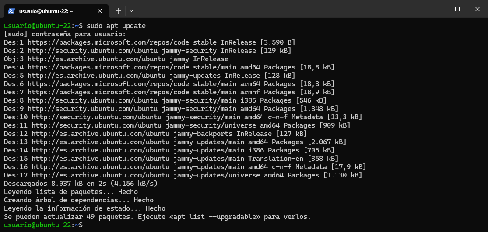
## 2. Instalar Postgres
```bash
sudo apt install postgresql
```
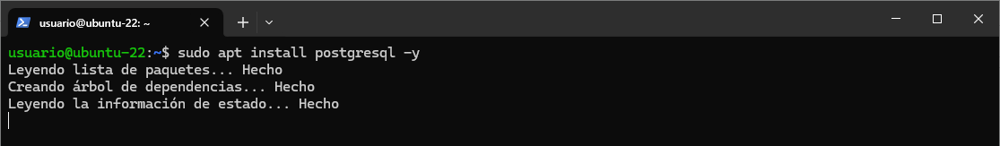
## 3. Iniciar y gestionar el servidor PostgreSQL
Aunque capaz ya viene esto, pero lo ponemos igualmente :)

```bash
sudo systemctl start postgresql
sudo systemctl enable postgresql
```
Con el siguiente comando podemos ver el estado, estara activo.
```bash
sudo systemctl status postgresql
```

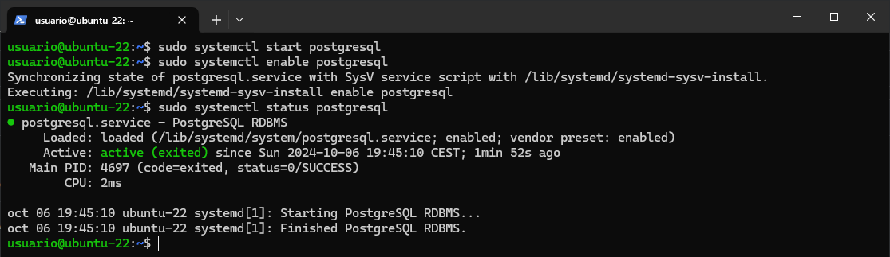
## 4. Entramos al usuario postgres
Indicamos la contraseña de nuestro usuario, claro, dando por hecho que estamos en un usuario con permisos de `sudo`.
```bash
sudo su - postgres
```

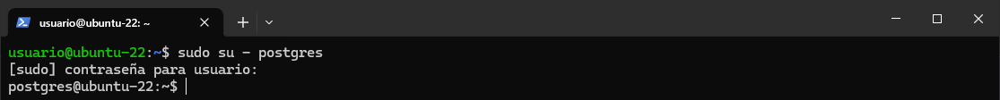
## 5. Ingresamos al cliente `psql` para interactuar con el servidor y modificacion de contraseña del usuario postgres
Ejecutamos 
```bash
psql
```
Escribimos la siguiente orden y indicamos la contraseña que queramos.
```bash
\password postgres
```
Yo escribí `password`. Y en Enter it again, volví a escribir `password`.

Finalmente, salimos con `exit` dos veces, una para salir de `psql` y otra para volver a nuestro usuario.
```bash
exit
```
```bash
exit
```

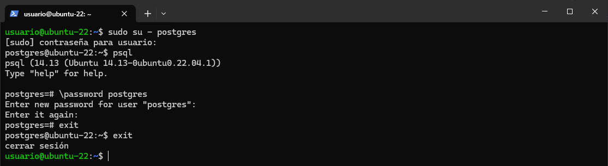
## 6. Ajustar el acceso y cambiar la configuración de red
En este paso vamos a tener que configurar dos archivos. `pg_hba.conf` y `postgresql.conf`.

Voy a usar `vim` para modificar los archivos, podeis usar cualquier otro `nano`, `emacs`, `vscode`...

NOTA > *🤓☝️ Para descargar `vim` se puede usar `sudo apt install vim -y`.*

### 6.1 `pg_hba.conf`
Este archivo define cómo los clientes se autentican cuando intentan conectarse al servidor PostgreSQL.

Mas info en: https://www.postgresql.org/docs/current/auth-pg-hba-conf.html

```bash
sudo vim /etc/postgresql/14/main/pg_hba.conf
```

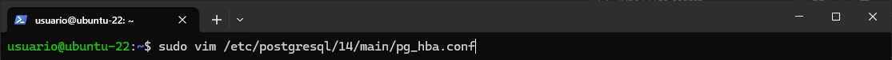
Abajo del todo del archivo vamos a escribir lo siguiente (son tabs, no espacios).
```conf
host  all    all    0.0.0.0/0    md5
```
- `host` -> permite conexiones TCP/IP.
- `all` -> aplica a todas las bases de datos y usuarios.
- `0.0.0.0/0` -> permite las conexiones desde cualquier IP
- `md5` -> indica que se usara la autenticacion basada en contraseña.
Guardamos los cambios (si estas con `vim` es dandole al `Esc` y escribir `:wq!`, finamente click al `Enter`).

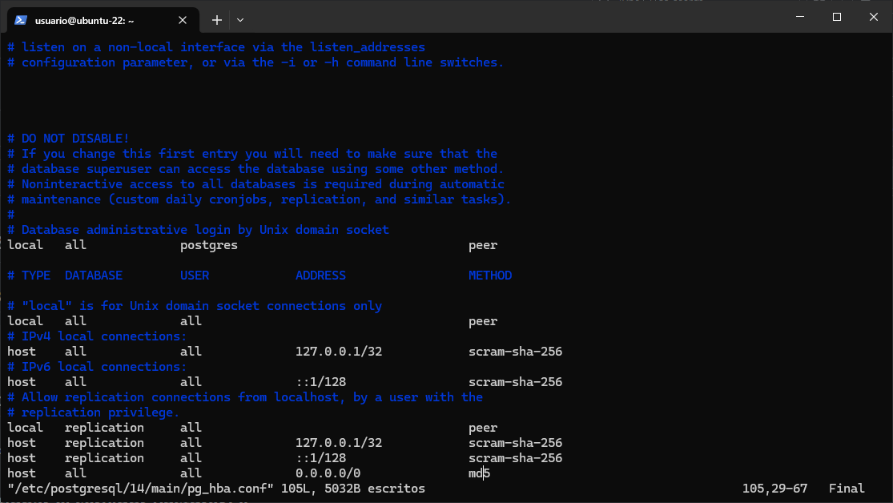
### 6.2 `postresql.conf`
Este archivo es donde se configura ajustes generales del servidor, coo el puerto y la direccion IP desde la cual escucha el server PostgreSQL.

Mas info en: https://www.postgresql.org/docs/current/config-setting.html

```bash
sudo vim /etc/postgresql/14/main/postgresql.conf
```

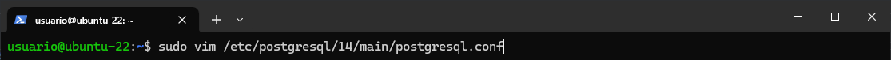
Buscamos la linea que define `listen_addresses` (normalmente viene comentada con `#`) y la descomentamos, y cambiamos su valor a lo siguiente:
```conf
listen_addresses = '*';
```
Esta es la imagen antes del cambio:

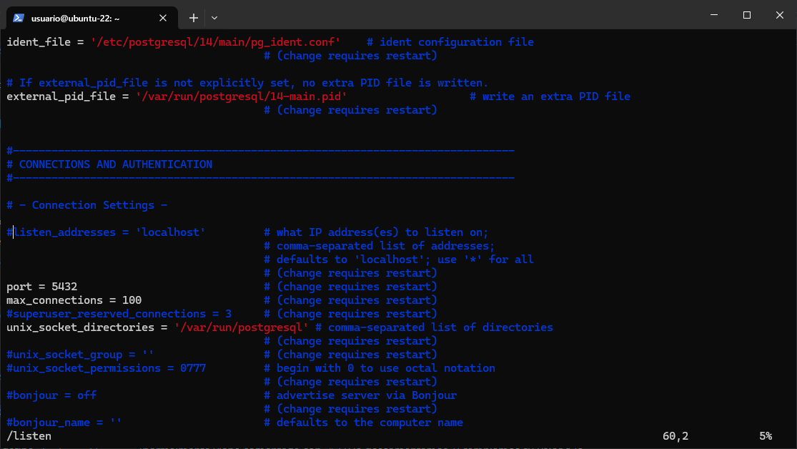
Esta es la imagen despues del cambio:

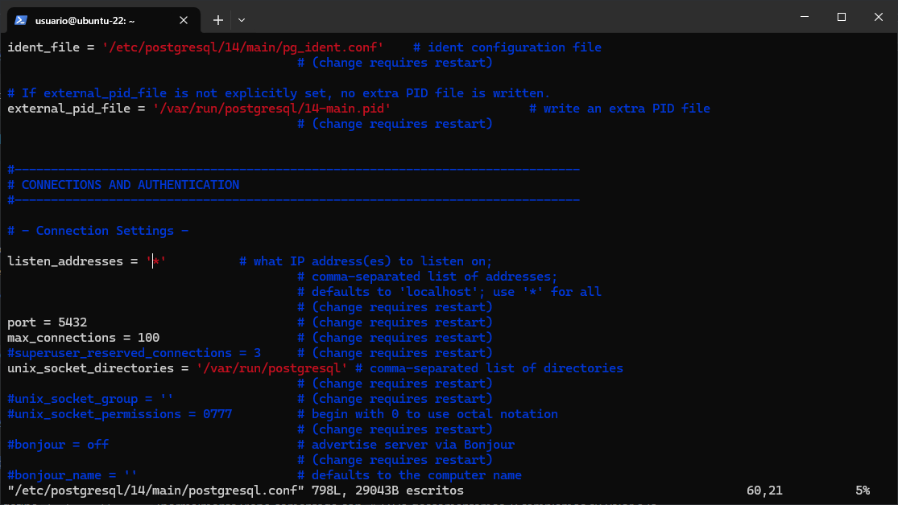
Guardamos el archivo. (si estas con `vim` es dandole al `Esc` y escribir `:wq!`, finamente click al `Enter`).
## 7. Abrimos el puerto en el firewall (opcional)
Si tienes un firewall habilitado, necesitarás permitir conexiones en el puerto predeterminado de PostgreSQL (5432): 
```bash
sudo ufw allow 5432/tcp
```

## 8. Reiniciamos el servicio para aplicar los cambios
```bash
sudo systemctl restart postresql
```
Podemos ver el estado con la siguiente orden
```bash
sudo systemctl status postgresql
```

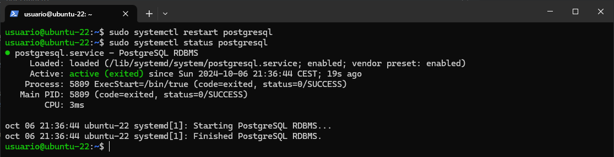

---
Hasta aqui la instalacion :)
