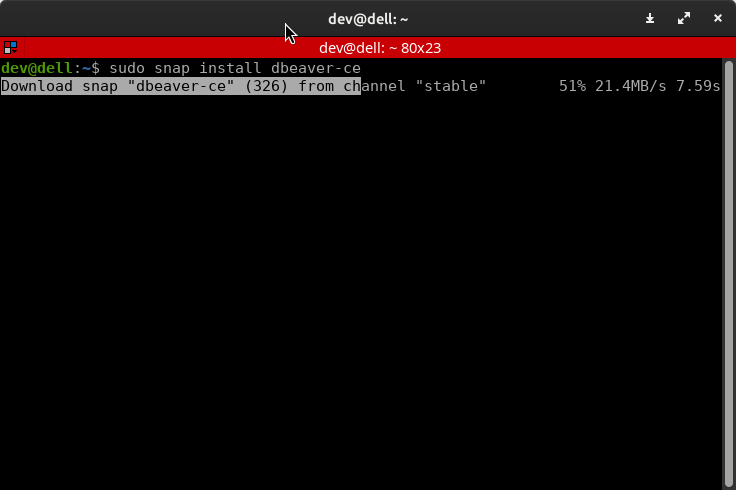

# Postgres 🐘 desde DBeaver 🦫 (Acceder remotamente)
Para conectarte a PostgreSQL debe estar la configuracion remota configurada. Y las maquinas deben poder verse entre ellas. Hay que asegurarse que las conexiones remotas sean correctas.

## 1. Instalacion DBeaver 🦫
Ejecutaremos el siguiente comando para instalar `BBeaver`.
```bash
sudo snap install dbeaver-ce
```

## 2.
## 3.
## 4.
## 5.
## 6.
## 7.
## 8.
## 9.
## 10.


